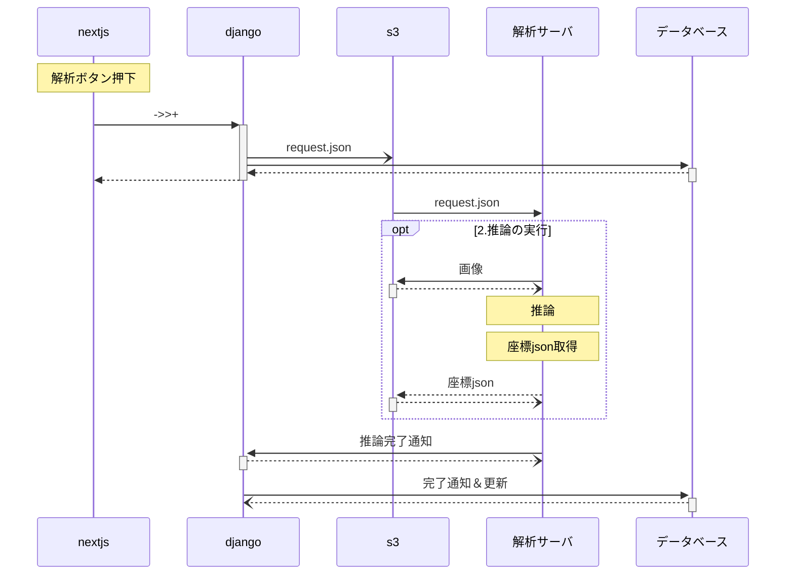

```mermaid
sequenceDiagram
    %% 宣言
    participant nextjs as nextjs
    participant django as django
    participant storage as s3
    participant server as 解析サーバ
    participant db as データベース

    Note over nextjs: 解析ボタン押下
    nextjs->>+django: ->>+
    django-)storage:request.json
    django->>+db:
    db-->>-django:
    django-->>-nextjs:

    storage->>server:request.json
    opt 2.推論の実行
        server->>+storage: 画像
        storage--)-server:
        Note over server: 推論
        Note over server: 座標json取得
        server-->>+storage:座標json
        storage--)-server:
    end
    server->>+django: 推論完了通知
    django--)-server:
    django->>+db:完了通知＆更新
    db--)-django:

```