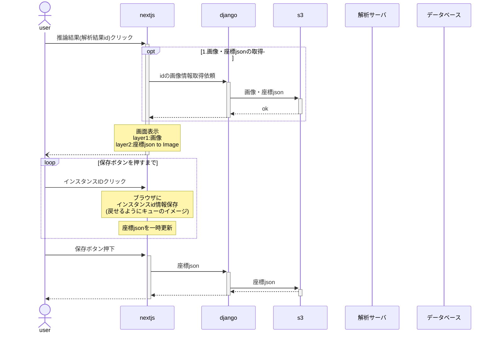

```mermaid
sequenceDiagram
    %% 宣言
    actor user as user
    participant nextjs as nextjs
    participant django as django
    participant storage as s3
    participant server as 解析サーバ
    participant db as データベース

    user->>+nextjs:推論結果(解析結果id)クリック
    opt 1.画像・座標jsonの取得
        nextjs->>+django: idの画像情報取得依頼
        django->>+storage:画像・座標json
        storage-->>-django:ok
        django-->>-nextjs:
    end
    Note over nextjs: 画面表示<br>layer1:画像<br>layer2:座標json to Image
    nextjs--)-user:
    loop 保存ボタンを押すまで
        user->>+nextjs:インスタンスIDクリック
        Note over nextjs: ブラウザに<br>インスタンスid情報保存<br>(戻せるようにキューのイメージ)
        Note over nextjs: 座標jsonを一時更新
    end
    user->>+nextjs:保存ボタン押下
        nextjs->>+django:座標json
        django->>+storage:座標json
        storage-->>-django:
        django-->>-nextjs:
    nextjs-->>-user:

```
※座標jsonには、削除id情報も扱えるようにしておく。 
※座標jsonはバージョン管理できるようにしておくとなおよい。
※クラス分類を含めた包括的な設計にする。
