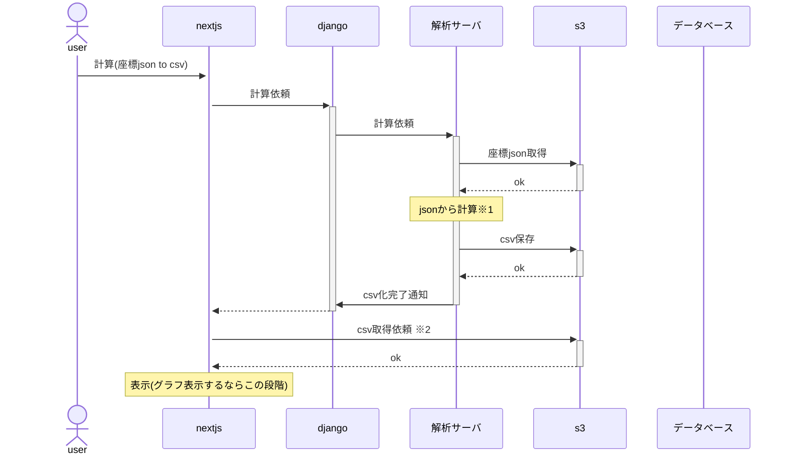

※再計算ロジックは要検討しなければならない。 
※1 json to csv は、現在のExcel生データ 
※2 djangoから渡すのはデータ量的に愚策な気がする。 
※jsonを追加で渡せば、フィルター機能の時、スライダーなどを使用して、動的に画面を変更できそうな気がする。 
※バックエンドで非同期でExcel化まで走らせてしまうのはあり。 

※スケールバーの設定についても再考する必要あり、 
ゆくゆくは、この表示段階の前で、変更できるようにできたらなおよい。 
(いったんは放置してもよい気がしています) 